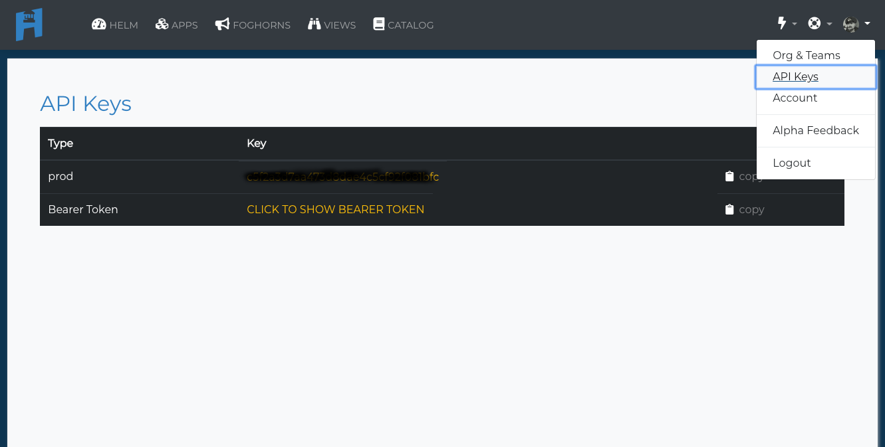

# API Docs

Welcomet to the Harbor API.  Today we only expose a couple of elements of our API during the alpha.  Everything in the system is accessible via the API (such as adding users, beacons, foghorns, etc.), but we won't be exposing those endpoints until the beta relase.  But for now you can do the two most important things on the system.  Send __beacon messages__ and connect to a __wss stream__ to view and manipulate those messages in your custom code.

If you want to quickly brush up on our terminology, feel free to take a quick refresher at the [Basic Terminology](basic-terminology.md).

## Authenticate with apiKey

Currently Harbor uses your apiKey to authenticate all requests.  You can find your apiKey under your avatar at [Harbor Cloud]("https://cloud.hrbr.io/#") by clicking your avatar in the upper right hand corner.  

## Send Beacon messages

The basis of all that is Harbor. Send a boat load of messages.  Why not the first 5 million every month are free.  So let's start sending.

The basic format of a Beacon message is an `HTTPs` post with 7 header fields.

Paramater  |Value   |Paramater  Type   |Data  Type   |Req?|Description
:---|:---|:---|:---|:--|:---
Content-Type|`application/json`   |  header  |string   |__YES__|Lets us know we are getting JSON
apiKey  |`YOUR_API_KEY`   |header   |string   |__YES__|  Your API Key
beaconVersionId  |`BEACON_VERSION_ID`|heder   |string   |__YES__|The name of the beacon you are sending
appVersionId  |`YOUR_APPS_VERSION_ID`   |header|string   |__YES__|The ID of the app in Harbor you want this beacon to identify with
beaconInstanceId  |`UNIQUE_SYSTEM_ID`   |header|string   |__NO__|Takes an identifier suce as a `HOSTNAME` or `MAC address` so you can tell what system sent the beaon
beaconMessageType  |`TYPE_OF_TYPE`   |header   |string |__KIND_OF__|  This is a meta field that allows you to look at similar beacons from multiple beaconVersionId's.  While this field is not mandatory, most of the UI features in `cloud.hrbr.io` require a beaconMessageType.

## Connect to Beacon stream

Connecting to a beacon stream is a little different than a standard https post or get as we send the streams down a web-socket.
