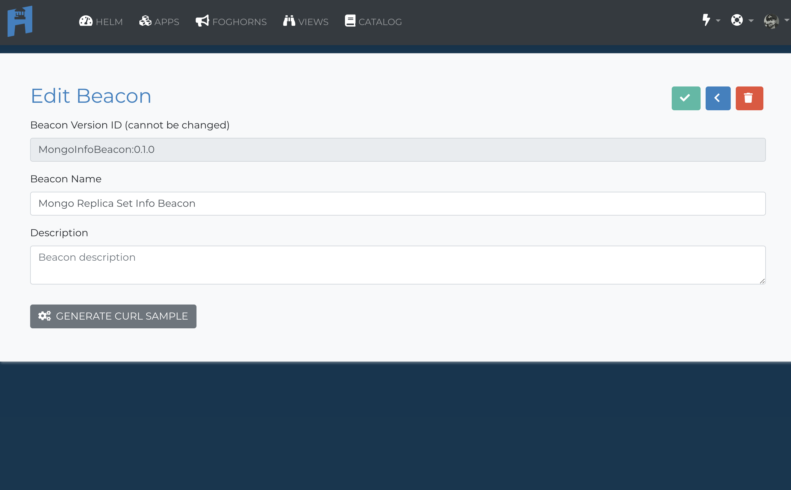

# API Docs

Welcomet to the Harbor API.  Today we only expose a couple of elements of our API during the alpha.  Everything in the system is accessible via the API (such as adding users, beacons, foghorns, etc.), but we won't be exposing those endpoints until the beta release.  But for now you can do the two most important things on the system.

1. Send __beacon messages__ to get data into HarborIconWhite
2. Connect to a __wss stream__ to view and manipulate those messages in your environments and code.

!!! info
    If you want to quickly brush up on our terminology, feel free to take a quick refresher at the [Basic Terminology](basic-terminology.md).

    Before you start using the API you will also need to set up your app in the [Harbor UI](https://cloud.hrbr.io/).  Click here for a [Quick Start Guide](quick-start-guide.md) for complete instructions on how to do that.

---
## Short Cuts
For those who don't like reading docs here is a quick Curl Example and a super easy Postman link to dive right in.

### Curl
```
curl -i -X POST \
  https://harbor-stream.hrbr.io/beacon \
  -H 'Content-Type: application/json' \
  -H 'apiKey: YOUR_API_KEY' \
  -H 'appVersionId: APP_VERSION_ID' \
  -H 'beaconInstanceID: UNIQUE_SYSTEM_IDENTIFIER' \
  -H 'beaconMessageType: TYPE_OF_MESSAGE' \
  -H 'beaconVersionID: BEACON_VERSION_ID' \
  -H 'cache-control: no-cache' \
  -d '{
    "YOUR":"VALID_JSON"
}'
```
### Postman

[](https://app.getpostman.com/run-collection/7f988710d5854865c0e5)

___
## What you need from cloud.hrbr.io

### Get your apiKey

Currently Harbor uses your apiKey to authenticate all requests.  You can find your apiKey under your avatar at [Harbor Cloud]("https://cloud.hrbr.io/#") by clicking your avatar in the upper right hand corner.  


### Get your appVersionId and App Harbor UUID

You will have to have an app registered in the [Harbor UI](https://cloud.hrbr.io/#!/apps/list).  You can find the AppVersionId and App Harbor UUID on the applications page.

!!! Warning
    You want to use the __AppVersionId__ not the __App Harbor UUID__ for your posts.


### Get your beaconVersionId

The beaconVersionId will also need to be registered for the related appVersionId.  You can find it by hitting the pencil icon on the app page.



---
## Send Beacon messages

The basis of all that is Harbor. Send a boat load of messages.  Why not? The first 5 million every month are free.  So let's start sending.

### Beacon Message Parameters

The basic format of a Beacon message is an `HTTPs` post with 7 header fields.

!!! info
    The url for sending a beacon is `https://harbor-stream.hrbr.io/beacon`

Paramater  |Value   |Paramater<br> Type   |Data<br> Type   |Req?|Description
:---|:---|:---|:---|:--|:---
Content-Type|`application/json`   |  header  |string   |__YES__|Lets us know we are getting JSON
apiKey  |`YOUR_API_KEY`   |header   |string   |__YES__|  Your API Key
beaconVersionId  |`BEACON_VERSION_ID`|heder   |string   |__YES__|The name of the beacon you are sending
appVersionId  |`APP_VERSION_ID`   |header|string   |__YES__|The ID of the app in Harbor you want this beacon to identify with
beaconInstanceId  |`UNIQUE_SYSTEM_ID`   |header|string   |__NO__|Takes an identifier such as a `HOSTNAME` or `MAC address` so you can tell what system sent the beacon
beaconMessageType  |`TYPE_OF_MESSAGE`   |header   |string |__KIND_OF__|  This is a meta field that allows you to look at similar beacons from multiple beaconVersionId's.  While this field is not mandatory, most of the UI features in `cloud.hrbr.io` require a beaconMessageType.
dataTimestamp  |`TIME_STAMP_FROM_BEACON`   | header  |integer   |__NO__   |  Harbor will put a timestamp on every message received at the time it is received.  If you are sending delayed messages or want the exact time something occurred on your system you can add your own timestamp.  Milliseconds from the Epoch.

### Samples
Remember you can check here for a [curl example](#curl) or here for a [Postman example](#postman).

----

## Connect to outbound Beacon streams

Connecting to a beacon stream is a little different than a standard https post or get as we send the streams down a web-socket.

Connecting to an outbound stream:
The format of the URL is as follows:

    wss://harbor-stream.hrbr.io/stream/YOUR_API_KEY
    wss://harbor-stream.hrbr.io/stream/YOUR_API_KEY/beacon/BEACON_UUID
    wss://harbor-stream.hrbr.io/stream/YOUR_API_KEY/beacon/BEACON_UUID/type/BEACON_MESSAGE_TYPE
    wss://harbor-stream-hrbr.io/stream/YOUR_API_KEY/application/APP_UUID
    wss://harbor-stream.hrbr.io/stream/YOUR_API_KEY/application/APP_UUID/type/BEACON_MESSAGE_TYPE

You can receive a stream in three ways.

### All Message Stream

Parameter  |Required   | Description
--|---|---
YOUR_API_KEY  |  __YES__ | Your API Key

This will send out every message on your API key which for now means every message coming into your organization. See [here](#get-your-apikey) to find out how to get your apiKey.

Sample url:

`wss://harbor-stream.io/stream/e973ca712cbf357ca071ab85a582b4c6`

### Message by Beacon

Parameter  |Required   | Description
--|---|---
YOUR_API_KEY  |  __YES__ | Your API Key
BEACON_UUID  | __YES__  |
BEACON_MESSAGE_TYPE   |__NO__| You can assign a beacon message type as an additional filter

!!! Warning
    Since streams require params in the URL we use the __Beacon UUID__ here not the __beaconVersionId__.

Sample url:

`wss://harbor-stream.io/stream/e973ca712cbf357ca071ab85a582b4c6/beacon/953d849c-e365-1004-8599-42b1febe886f/type/MONGOINFO`


### Message Stream by App

Parameter  |Required   | Description
--|---|---
YOUR_API_KEY  |  __YES__ | Your API Key
BEACON_UUID  | __YES__  |
BEACON_MESSAGE_TYPE   |__NO__| You can assign a beacon message type as an additional filter

!!! Warning
    Since streams require params in the URL we use the __App Harbor UUID__ here not the __appVersionId__.

Sample url:

`wss://harbor-stream.io/stream/e973ca712cbf357ca071ab85a582b4c6/application/4539a508-e3aa-1004-8710-6bb8457af470/type/MONGOINFO`

### Test your streams

The simplest way to see your Web Socket streams is directly at [Harbor Cloud](https://cloud.hrbr.io/#!/apps/list).  There you can `go to developer console` and choose `raw console` to see your Web Socket stream and the actuall url.


To check other streams here are two of many ways to check yours.

1. Check it out in browser at [websocket.org](https://websocket.org/echo.html).
2. Install a Chrome extension such as [Simple Web Socket](https://chrome.google.com/webstore/detail/simple-websocket-client/pfdhoblngboilpfeibdedpjgfnlcodoo?hl=en).

There you have it.  Stay tuned for even more examples and calls in the future.
