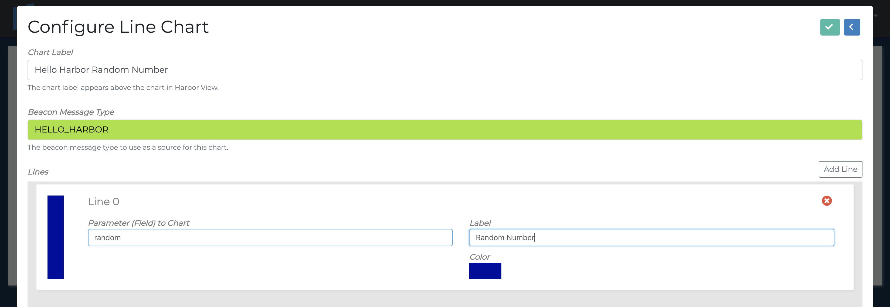
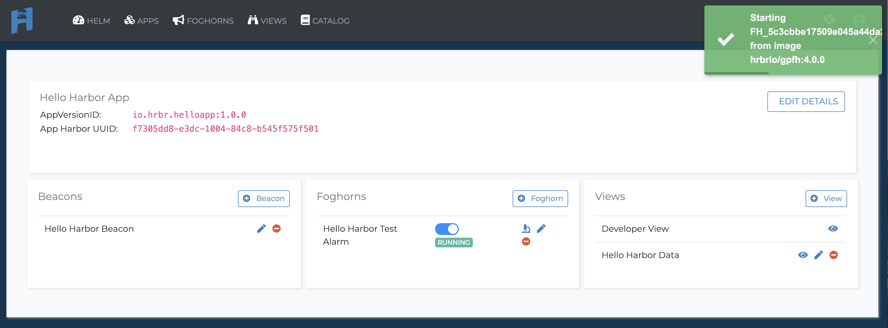

<h1>Step-by-Step Guide</h1>

Before you start this guide you may want to familiarize yourself with our basic terminology.  Check it out here [Basic Terminology](basic-terminology.md)

## Sign up for Hrbr Account

You can use your Google Account ID, Github Login or just use your e-mail.


<!-- ## Create an Org
If you aren't already in an organization, you will need to create an organization.  All applications have to belong to an organization.


 -->

## Create an Application
This first thing box you'll see is a Create an application pop-up.  This allows you to start right away.

!!! Warning
    Your first application will be created in your Sandbox organization.  Only you will have access to it.  To create applications to share you will need create an Organization first.  See Create Orgs below.


Select the add an application button.
Add an application ID.

!!! Tip
    We sugguest you use the same reverse dns notation you use for your apps in general.  i.e `io.hrbr.docs:1.0.0`


## Beacons

### Create a Beacon
Once you've added your application the first thing you have to do is add a Beacon in for that application.


!!! Reminder
    A Beacon collects data relevant to your application and sends that data to Hrbr.

You can write your own Beacons or your can use a pre-written Beacon template that can be found in the Hrbr Catalog. For this guide we will use a pre-written Beacon to check the system stats on our doc servers.

First of all we are going to click the `+ Beacon` button.  In Beacon Version Id you will enter `harbor-linux-sysinfo-beacon:0.3.0`.  As we will see when go to install the Beacon on our server that is the default beaconVersionId for this beacon.

Then give the Beacon a descriptive name and description and choose `SAVE`.


!!! info
    Follow the `READ.md` instructions on installing the Hrbr System Information Beacon For Linux.

### Install the Beacon

#### Get the Beacon from the Catalog

Now we need to install the beacon on our server to start sending data.

!!! Warning
    You need to install a beacon on your server or in your application before you can create Foghorns (alerts) or Views.  The HRBR cloud needs to be recieving data in order to see the fields that you sending through.

While you can always write your own beacons HRBR has a number of opensource beacons for you to use and modify as you choose.  For the tutorial we are going to use the LinuxSysInfoBeacon from the HRBR Catalog.
If you want to jump ahead and look at this yourself go to the  and check out the  `LinuxSysInfoBeacon`.  That's for gathering systems stats from your app servers.  You can directly go to this Beacon at [https://github.com/HrbrIO/LinuxSysInfoBeacon](https://github.com/HrbrIO/LinuxSysInfoBeacon)


We can selext the `Linux System Information Monitor Beacon` for more information.


!!! info
    Install the beacom in accordance to the `READ.md` in GitHub.

For any beacon to be able to send data to your account it needs to know which organization which applicatation being observed to send the data to.  So we are going to need two pieces of data.  Our API_Key and our appVersionId.

!!! Warning
    Double-check the beaconVersionId is `harbor-linux-sysinfo-beacon:0.3.0` in case it's been updated.  You must make sure the Beacon Version ID matches the beaconVersionID in your Beacon.  Otherwise Hrbr will not accept the Beacon.


#### Configure the Beacon on your system

Your find your API key on the website by clicking on the icon with your avatar (far right of nav bar) then selecting API Keys.


If you've forgotten your appVersionId just hit Apps and you can see it's `io.hrbr.docs:1.0.0`.


For this Beacon there is a `options.json` file we edit with our information.  Edit with your favorite text editor to put in your API key and the `io.hrbr.helloapp:1.0.0`.

``` javascript
// You find your API key on the website by clicking on the icon with your avatar (far right of nav bar) then
// selecting API Keys. Enter it here.
"apikey": "YOUR_API_KEY_HERE"

// Now you need to have a valid appVersionId. To get one, create an app in your account. appVersionId's use a naming
// convention similar to a lot of bundle/docker ids which is a combination of RDNS and semantic versioning. Example:
// io.hrbr.mycoolapp:1.0.0. Feel free to use the appVersionId shown below for this tutorial.

"appVersionId": "io.hrbr.docs:1.0.0",

// I'm also going to change the sample rate to once every 5000 milliseconds so I can see my data more quickly

"sampleInterval": 5000

```

The Hello Harbor Beacon runs a standalone app so we'll need to start it to collect information.  Go ahead and run `node .` in the base directory for the Beacon.

And now you are are sending your first messages to Hrbr.  You can double check what's coming into Hrbr by selecting your app.


The you can select go to developor view.  It's in the bottom right of the application page.


After waiting a few seconds you can see the Beacon messages.


<!-- ### Test your Beacon

If you want to try a simple curl code to make sure you system is receiving beacons you can go to edit the Beacon and the will be a `Generate Curl Sample` button.


You will see a curl sample here:
```
curl -i -X POST \
 -H "Accept: application/json" -H "Content-type: application/json" \
 -H "apikey:YOUR_API_KEY_HERE" \
 -H "appVersionId:io.hrbr.helloapp:1.0.0" \
 -H "beaconVersionId:io.hrbr.howdybeacon:1.0.0" \
 -H "beaconInstanceId:cut-n-paste" \
 -H "beaconMessageType:CURL_TEST" -d '{"message":"Hello from Curl!"}' \
  https://Hrbr-stream.hrbr.io/beacon
```

You can find much more detailed instructions in playing around with the Beacon Messages in our [API Docs](api.md). -->

## Add a View

To add a view we need to return to our application screen.


Click to add a new view.  We'll name our `Harbor Docs Server Info`. Then hit save.


After saving we can choose the add chart button.  We are going to add a simple line chart. Name the chart as you see fit.  Then add `HELLO_HARBOR` into the Beacon Message Type.  We know HELLO_HARBOR is the Beacon Message Type for this by reading the config in the `index.js`

!!! Info
    BeaconMessageType is a way to tag your beacons.  It allows you to send different types of data with a single beacon or allows you to look at similar data from multiple beacons.  While not required to work with Hrbr it is necessary if you want to use our internal View and Foghorn tools.



Select Check to save your chart and you should be good to go.


To View the chart select View from the main menu and choose Display from Hello Hrbr Data.


## Create a Foghorn
Now let's create a Foghorn to alert us if there is an issue.  Setting up a Foghorn is very similar to setting up a view so let's set one up using the same 'random' data we did for the view.
Return to the application management screen by clicking on our `io.hrbr.harbordocs:1.0.0` app.


Select to add a new Foghorn.

Let's call this our High CPU foghorn.  Select `Linux Sys Info Beacon for Docs` from the Beacon Version ID to Monitor drop down list.


Once in the Edit Foghorn page. You'll want to click on the <button style="background:#3CB29A;color:white;border:0">TRIGGERS</button>.  Then click the <button style="background:white;border-color:blue;border-style: solid;color:blue">+ Add Trigger Entry</button>.


There a number of fields to fill out here so let's break them down quickly.  We'll start with setting a trigger.


| Field                          |                                                             |
| ------------------------------ | ----------------------------------------------------------- |
| Foghorn Name                   | Whatever you want it be.  Might as well make it despriptive |
| Foghorn Description            | In case your name wasn't descriptive enough                 |
| Beacon Message Type to Monitor | For our Linux System Information Beacon it's SYSINFO        |
| Trigger Field | Again the Dot Notation that allows the Foghorn to read down your JSON. Here again it's currentLoad.avgload |
| Trigger Type | Plenty of pre-built triggers.  We are going with the simple Instantaneous Reading Above> so we can check this immediately. |
| Value	|The value you are measure agains.  We want to see if the CPU goes over 50%.|

Now you'll want to add a response.  Select the <button style="background:#3CB29A;color:white;border:0">RESPONSES</button>
button and add where you want your response sent.


Here are the fields to

| Field                          |                                                             |
| ------------------------------ | ----------------------------------------------------------- |
| Add Response+ |	You can choose between slack, sms and email.  Since I don't have my slack API key handy, I'm going with e-mail. For instuctions on how to add a Slack Repsonse check out the [Slack Integration Guide.](slack-integration.md)|
| Email Response |The email you want notified.  You can also make changes to the default notification.

Once you have filled out the information and submit the form you will need to take one more step of actually starting your Foghorn.  By default a Foghorn's initial state is stopped.





And if all is well you should start receiving e-mails every Hello Harbor generates a random number over .9.


!!! Summary
    Now you should be familiar enough to start using pre-built Beacons to start getting insight on standard system issues.  Stay tuned for more in depth guides on creating your own Beacons from scratch and subscribing to Hrbr streams to get use all the great data for your own custom Foghorns and Views.
