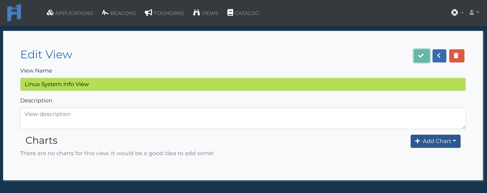
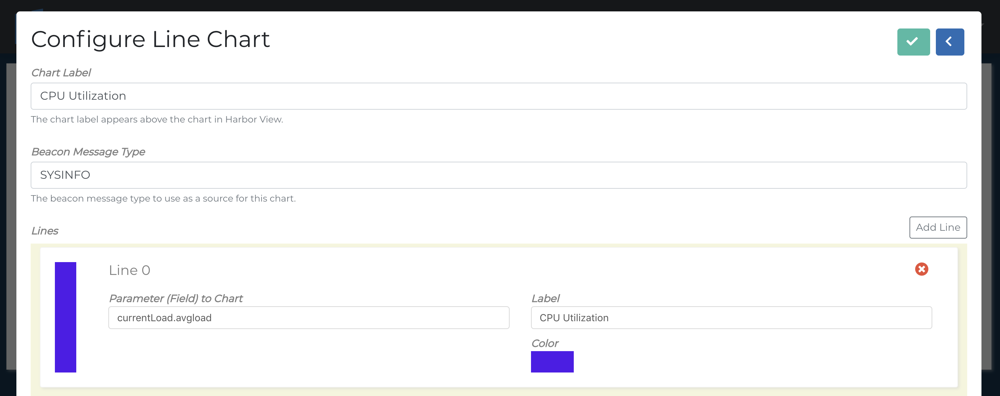

<h1>Step-by-Step Guide</h1>

Before you start this guide you may want to familiarize yourself with our basic terminology.  Check it out here [Basic Terminology](basic-terminology.md)

## Sign up for Harbor Account

You can use your Google Account ID, Github Login or just use your e-mail.


## Create an Org
If you aren't already in an organization, you will need to create an organization.  All applications have to belong to an organization.


## Add an Application
Click the Apps menu.


Select the add an application button.
Add an application ID.

!!! Tip
    We sugguest you use the same reverse dns notation you use for your apps in general.  i.e `tv.ourglass.cloud:1.0.0`


## Create a Beacon
Once you've added your application the first thing you have to do is add a Beacon in for that application.

!!! Reminder
    A Beacon collects data relevant to your application and sends that data to harbor.

Pre-written Beacon templates can be found in the Harbor Catalog.
For this guide we will use a pre-written Beacon to check the system stats of one of our database servers.
I'm going to the catalog to find Harbor System Information Beacon for Linux.
You can directly go to this Beacon at [ https://github.com/HrbrIO/LinuxSysInfoBeacon](https://github.com/HrbrIO/LinuxSysInfoBeacon)


!!! info
    Follow the `READ.md` instructions on installing the Harbor System Information Beacon For Linux.

## Registering the Beacon

You must register a Beacon before Harbor will accept messages from it.
!!! info
    The `READ.md` for the LinuxSysInfoBeacon tells us the default beaconVersionId is `harbor-linux-sysinfo-beacon:0.1.2`

Select the Apps menu and then. and select our application `tv.ourglass.cloud:1.0.0`.


Click on the Beacons section below the app.


!!! info
    The `READ.md` for the LinuxSysInfoBeacon tells us the default beaconVersionId is `harbor-linux-sysinfo-beacon:0.1.2`

Give the Beacon Version ID harbor-linux-sysinfo-beacon:0.1.2.

!!! Warning
    You must make sure the Beacon Version ID matches the beaconVersionID in your Beacon.  Otherwise Harbor will not accept the Beacon.

Finally we need to configure our Beacon to send messages to to our API Key and to our Application `tv.ourglass.cloud:1.0.0`.  To find your API Key click on your user avatar in the upper right hand corner and select API Keys.


For this Beacon there is a `options.json` file we edit with our information.  Edit with your favorite text editor to put in your API key and the `tv.ourglass.cloud:1.0.0`.

``` JSON
{
  "apikey": "YOUR_API_KEY_HERE",
  "beaconInstanceId": "auto:mac:en0",
  "appVersionId": "io.hrbr.mktest:1.0.0",
  "functions": [
    "fsSize",
    "currentLoad",
    "mem"
  ],
  "sampleInterval": 10
}
```

The Linux System Information Beacon runs a standalone app so we'll need to start it to collect information.  Go ahead and run node src/index.js in the base directory for the Beacon.

!!! Tip
    In the future if you want to run this Beacon as a service [pm2](http://pm2.keymetrics.io/) is a great process manager for node apps.

And now you are are sending your first messages to Harbor.  You can double check what's coming into harbor by selecting your app.


The you can select go to developor options.  After waiting a few seconds you can see the Beacon messages.


## Add a View

Before we can add a view or Foghorn we need understand what your Beacon is collecting and sending through  Beacon messages should be sent in standard JSON format.  By clicking on one of our Beacons messages we can see what our SYSINFO Beacon is sending through.  Here is sample message from our Linux System Information Beacon.  As you can see there are quite a few fields to choose from.  We are going to want to know CPU utilization so we will look at currentLoad and pick the field avgload.

``` json
"currentLoad": {
   "avgload": 0.39,
   "currentload": 9.579341940857976,
   "currentload_user": 5.893377759266972,
   "currentload_system": 3.685964181591004,
   "currentload_nice": 0,
   "currentload_idle": 90.42065805914203,
   "currentload_irq": 0,
   "raw_currentload": 4600,
   "raw_currentload_user": 2830,
   "raw_currentload_system": 1770,
   "raw_currentload_nice": 0,
   "raw_currentload_idle": 43420,
   "raw_currentload_irq": 0,
}
```
To add a view we need to return to our application screen.


Click to add a new view.  We'll name our Linux System Info View.



After selecting the check mark we can choose the add chart button.  We are going to add a simple line chart.
Name the chart as you see fit.  Then add SYSINFO into the Beacon Message Type.  By having a Beacon Message Type that allows you to look at data from many different Beacons.  We know SYSINFO is the Beacon Message Type for this Beacon from the readme in Github.



Select Check to save your chart and you should be good to go.


To View the chart select View from the main menu and choose Display from the Linux System Info View.


## Create a Foghorn
Now let's create a Foghorn to alert us if there is an issue.  Setting up a Foghorn is very similar to setting up a view so let's set one up using the same currentLoad.avgload data we did for the view.
Return to the application management screen by clicking on our tv.ourglass.cloud:1.0.0 app.


Select to add a new Foghorn.


There a number of fields to fill out here so let's break them down quickly.


| Field                          |                                                             |
| ------------------------------ | ----------------------------------------------------------- |
| Foghorn Name                   | Whatever you want it be.  Might as well make it despriptive |
| Foghorn Description            | In case your name wasn't descriptive enough                 |
| Beacon Message Type to Monitor | For our Linux System Information Beacon it's SYSINFO        |                               |
| Trigger Field | Again the Dot Notation that allows the Foghorn to read down your JSON. Here again it's currentLoad.avgload |
| Trigger Type | Plenty of pre-built triggers.  We are going with the simple Instantaneous Reading Above> so we can check this immediately. |
| Value	|The value you are measure agains.  We want to see if the CPU goes over 50%.|
| ADD RESPONSE+ |	You can choose between slack, sms and email.  Since I don't have my slack API key handy, I'm going with e-mail.|
| Email Response |The email you want notified.  You can also make changes to the default notification.

Once you have filled out the information and submit the form you will need to take one more step of actually starting your Foghorn.  By default a Foghorn's initial state is stopped.


And if all is well you should start receiving e-mails every time your system goes over 50% CPU Utilization.


!!! Summary
    Now you should be familiar enough to start using pre-built Beacons to start getting insight on standard system issues.  Stay tuned for more in depth guides on creating your own Beacons from scratch and subscribing to Harbor streams to get use all the great data for your own custom Foghorns and Views.
