<h1>Step-by-Step Guide</h1>

Before you start this guide you may want to familiarize yourself with our basic terminology.  Check it out here [Basic Terminology](basic-terminology.md)

## Sign up for Hrbr Account

You can use your Google Account ID, Github Login or just use your e-mail.


## Create an Org
If you aren't already in an organization, you will need to create an organization.  All applications have to belong to an organization.


## Add an Application
Click the Apps menu.


Select the add an application button.
Add an application ID.

!!! Tip
    We sugguest you use the same reverse dns notation you use for your apps in general.  i.e `io.hrbr.hellapp:1.0.0`

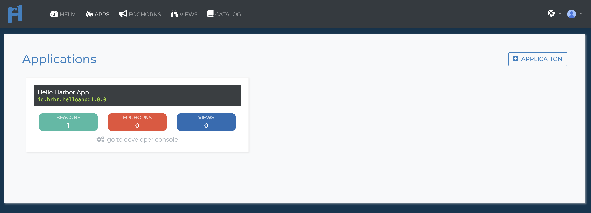

## Beacons

### Create a Beacon
Once you've added your application the first thing you have to do is add a Beacon in for that application.

!!! Reminder
    A Beacon collects data relevant to your application and sends that data to Hrbr.

Pre-written Beacon templates can be found in the Hrbr Catalog.
For this guide we will use a pre-written Beacon to check the system stats of one of our database servers.
I'm going to the catalog to find `Hello, Harbor!`.  That's a beacon used for learning how to use Hrbr.
You can directly go to this Beacon at [ https://github.com/HrbrIO/HelloHarborBeacon](https://github.com/HrbrIO/HelloHarborBeacon)

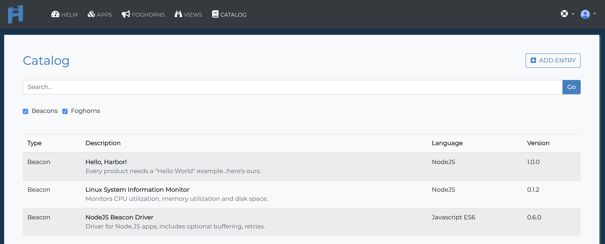

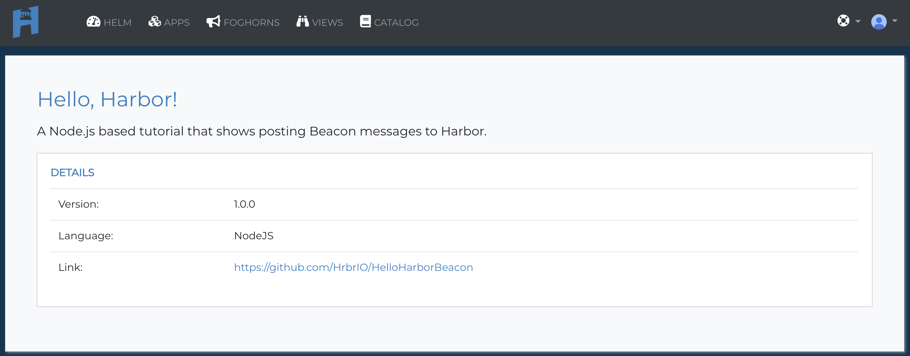

!!! info
    Follow the `READ.md` instructions on installing the Hrbr System Information Beacon For Linux.

### Registering the Beacon

You must register a Beacon before Hrbr will accept messages from it.
!!! info
    The `READ.md` for the HelloHarborBeacon tells us the default beaconVersionId is `io.hrbr.howdybeacon:1.0.0`

Select the Apps menu and then. and select our application `io.hrbr.helloapp:1.0.0`.


Click on the Beacons section below the app.


!!! info
    The `READ.md` for the LinuxSysInfoBeacon tells us the default beaconVersionId is `io.hrbr.howdybeacon:1.0.0`

Give the Beacon Version ID `io.hrbr.howdybeacon:1.0.0`.

!!! Warning
    You must make sure the Beacon Version ID matches the beaconVersionID in your Beacon.  Otherwise Hrbr will not accept the Beacon.

Finally we need to configure our Beacon to send messages to to our API Key and to our Application `io.hrbr.helloapp:1.0.0`.  To find your API Key click on your user avatar in the upper right hand corner and select API Keys.


For this Beacon there is a `index.js` file we edit with our information.  Edit with your favorite text editor to put in your API key and the `io.hrbr.helloapp:1.0.0`.

``` javascript
// You find your API key on the website by clicking on the icon with your avatar (far right of nav bar) then
// selecting API Keys. Enter it here.
const API_KEY = 'GET_YOUR_API-KEY_FROM_WEBSITE';

// Now you need to have a valid appVersionId. To get one, create an app in your account. appVersionId's use a naming
// convention similar to a lot of bundle/docker ids which is a combination of RDNS and semantic versioning. Example:
// io.hrbr.mycoolapp:1.0.0. Feel free to use the appVersionId shown below for this tutorial.

const APP_VERSION_ID = 'io.hrbr.helloapp:1.0.0';

// You also need to have a beacon registered to your app in order for Hrbr to accept the post. Beacons have a
// beaconVersionId which follows the same convention as the appVersionId, above. Let's use: io.hrbr.howdybeacon:1.0.0.

// You will need to add this beacon to your app by going to the app details page on the website, then clicking + BEACON.
// The beaconVersionId must match EXACTLY with what is below.

const BEACON_VERSION_ID = 'io.hrbr.howdybeacon:1.0.0';

// Each Beacon can have any number of beaconMessageTypes (BMT). Some beacons send only one type. That's the case with this
// example. A beacon message type is simply a string to help us identify different streams of monitoring data. Beacon Message
// Types *do not* need to be pre-registered in order for Hrbr to accept the message.

const BEACON_MESSAGE_TYPE = 'HELLO_HARBOR';

```

The Hello Harbor Beacon runs a standalone app so we'll need to start it to collect information.  Go ahead and run `node .` in the base directory for the Beacon.

And now you are are sending your first messages to Hrbr.  You can double check what's coming into Hrbr by selecting your app.


The you can select go to developor options.  After waiting a few seconds you can see the Beacon messages.

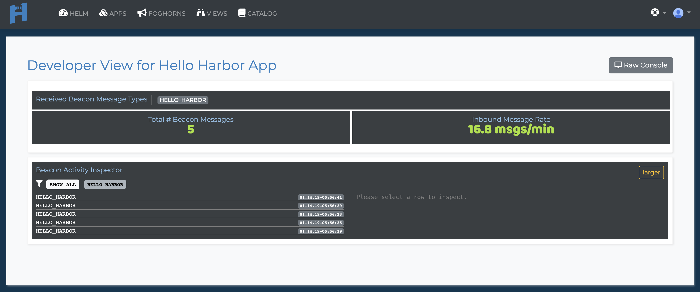

### Test your Beacon

If you want to try a simple curl code to make sure you system is receiving beacons you can go to edit the Beacon and the will be a `General Curl Sample` button.

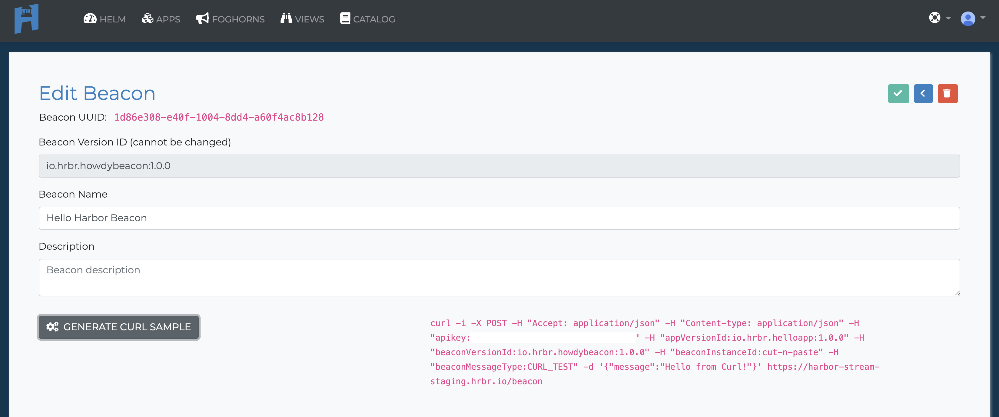

You will see a curl sample here:
```
curl -i -X POST \
 -H "Accept: application/json" -H "Content-type: application/json" \
 -H "apikey:YOUR_API_KEY_HERE" \
 -H "appVersionId:io.hrbr.helloapp:1.0.0" \
 -H "beaconVersionId:io.hrbr.howdybeacon:1.0.0" \
 -H "beaconInstanceId:cut-n-paste" \
 -H "beaconMessageType:CURL_TEST" -d '{"message":"Hello from Curl!"}' \
  https://Hrbr-stream.hrbr.io/beacon
```

You can find much more detailed instructions in playing around with the Beacon Messages in our [API Docs](api.md).

## Add a View

Before we can add a view or Foghorn we need understand what your Beacon is collecting and sending through  Beacon messages should be sent in standard JSON format.  By clicking on one of our Beacons messages we can see what our HelloHarbor Beacon is sending through.  Here is sample message from our HelloHarbor Beacon.  As you can see there are quite a few fields to choose from.  We are going to want to know CPU utilization so we will look at currentLoad and pick the field avgload.

``` json
"data": {
    "message": "Hello #11 from Harbor",
    "random": 0.27131707201113486
  },
```
To add a view we need to return to our application screen.


Click to add a new view.  We'll name our `Hello Harbor Data`.

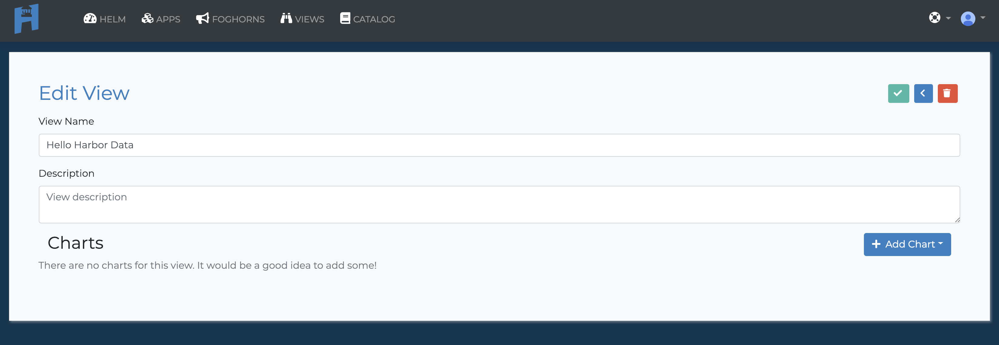

After selecting the check mark we can choose the add chart button.  We are going to add a simple line chart. Name the chart as you see fit.  Then add `HELLO_HARBOR` into the Beacon Message Type.  We know HELLO_HARBOR is the Beacon Message Type for this by reading the config in the `index.js`

!!! Info
    BeaconMessageType is a way to tag your beacons.  It allows you to send different types of data with a single beacon or allows you to look at similar data from multiple beacons.  While not required to work with Hrbr it is necessary if you want to use our internal View and Foghorn tools.


Select Check to save your chart and you should be good to go.

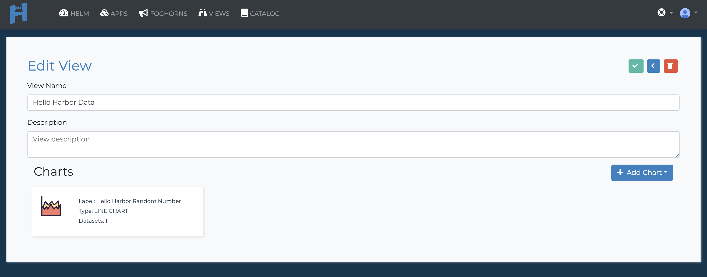

To View the chart select View from the main menu and choose Display from Hello Hrbr Data.

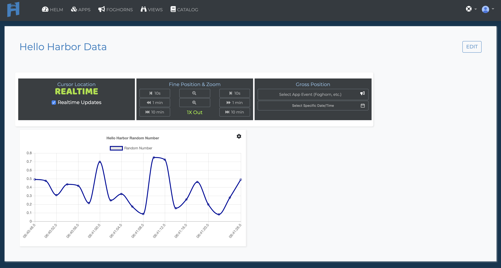

## Create a Foghorn
Now let's create a Foghorn to alert us if there is an issue.  Setting up a Foghorn is very similar to setting up a view so let's set one up using the same 'random' data we did for the view.
Return to the application management screen by clicking on our 'io.hrbr.helloapp:1.0.0' app.

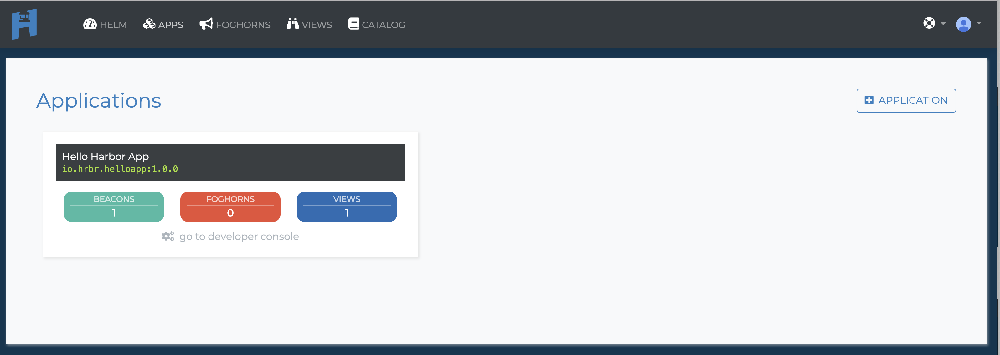

Select to add a new Foghorn.

Once in the Edit Foghorn page. You'll want to click on the <button style="background:#3CB29A;color:white;border:0">TRIGGERS</button>.  Then click the <button style="background:white;border-color:blue;border-style: solid;color:blue">+ Add Trigger Entry</button>.


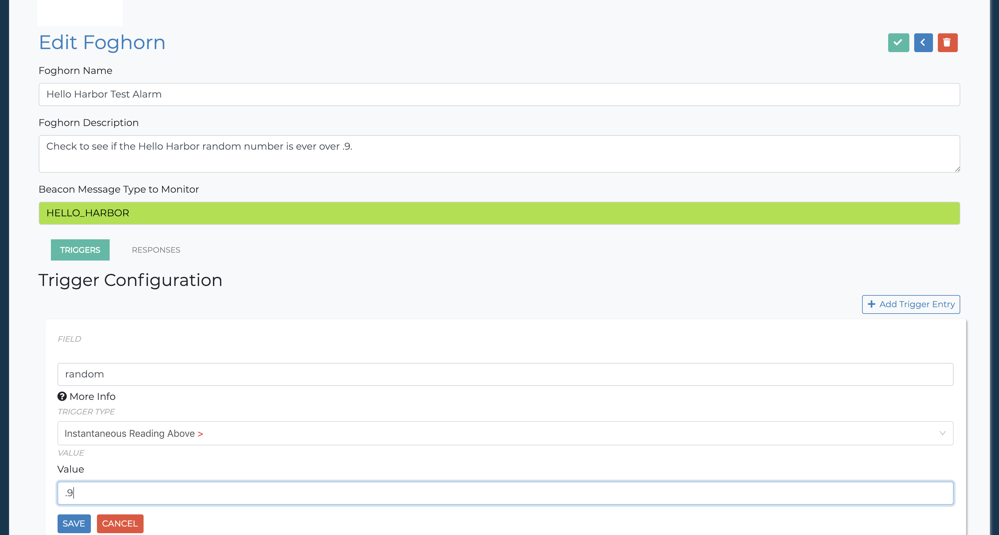

There a number of fields to fill out here so let's break them down quickly.  We'll start with setting a trigger.


| Field                          |                                                             |
| ------------------------------ | ----------------------------------------------------------- |
| Foghorn Name                   | Whatever you want it be.  Might as well make it despriptive |
| Foghorn Description            | In case your name wasn't descriptive enough                 |
| Beacon Message Type to Monitor | For our Linux System Information Beacon it's SYSINFO        |
| Trigger Field | Again the Dot Notation that allows the Foghorn to read down your JSON. Here again it's currentLoad.avgload |
| Trigger Type | Plenty of pre-built triggers.  We are going with the simple Instantaneous Reading Above> so we can check this immediately. |
| Value	|The value you are measure agains.  We want to see if the CPU goes over 50%.|

Now you'll want to add a response.  Select the <button style="background:#3CB29A;color:white;border:0">RESPONSES</button>
button and add where you want your response sent.

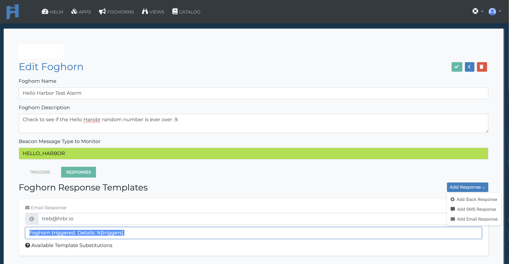

Here are the fields to

| Field                          |                                                             |
| ------------------------------ | ----------------------------------------------------------- |
| Add Response+ |	You can choose between slack, sms and email.  Since I don't have my slack API key handy, I'm going with e-mail. For instuctions on how to add a Slack Repsonse check out the [Slack Integration Guide.](slack-integration.md)|
| Email Response |The email you want notified.  You can also make changes to the default notification.

Once you have filled out the information and submit the form you will need to take one more step of actually starting your Foghorn.  By default a Foghorn's initial state is stopped.


And if all is well you should start receiving e-mails every Hello Harbor generates a random number over .9.


!!! Summary
    Now you should be familiar enough to start using pre-built Beacons to start getting insight on standard system issues.  Stay tuned for more in depth guides on creating your own Beacons from scratch and subscribing to Hrbr streams to get use all the great data for your own custom Foghorns and Views.
