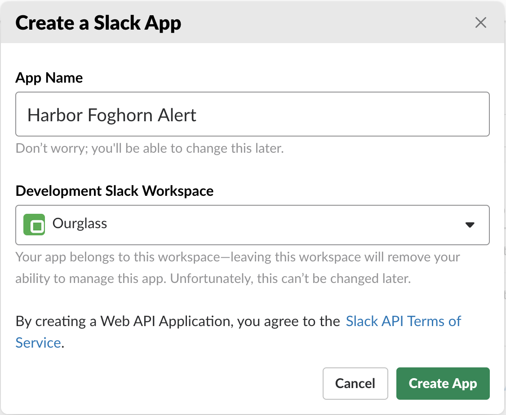
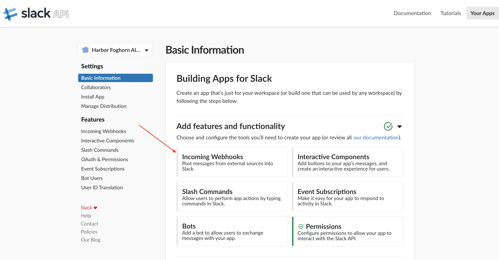
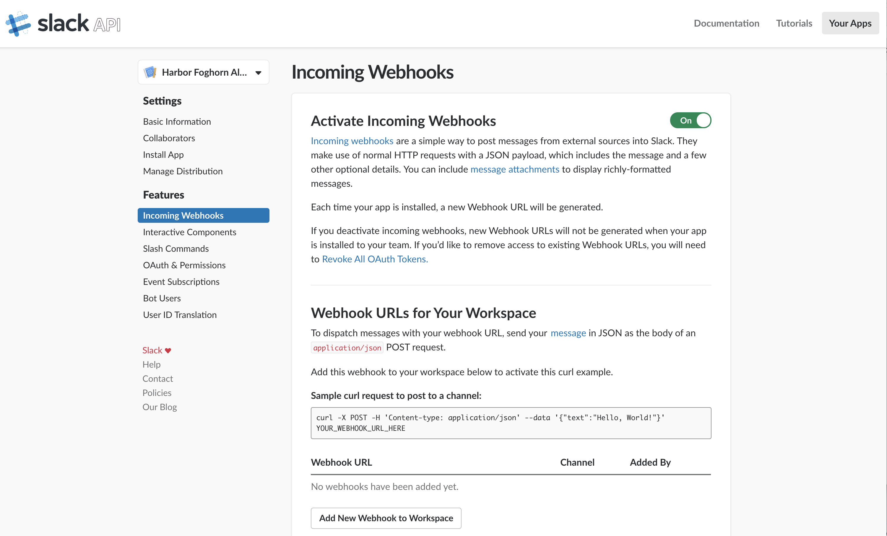
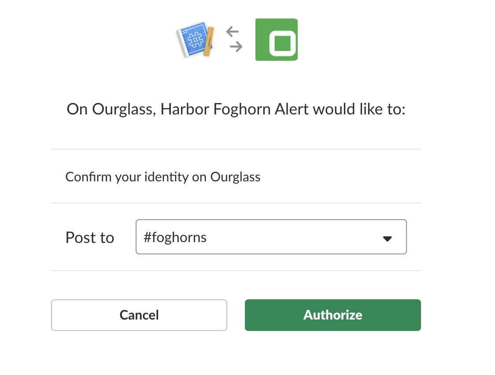
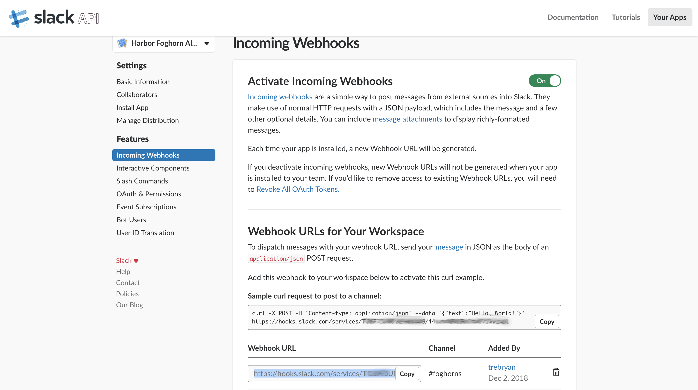
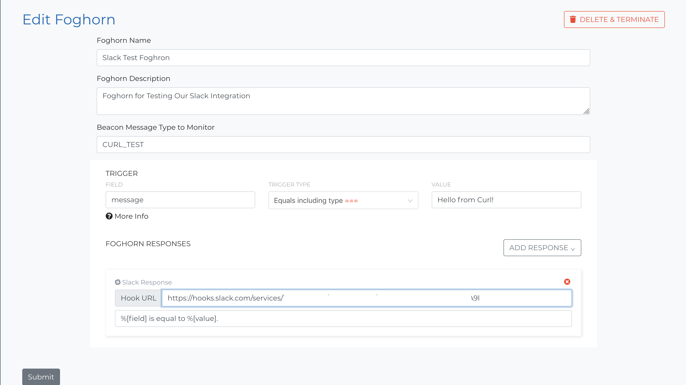

This how-to will show you how to do an integration with Slack so you can send foghorn alerts to a slack channel.

## Requirements

Application | |
--- | ---
__Slack__  | You must be a Slack admin to do this integration.
__Harbor__  | Any Harbor user can perform this action.

## Slack

In the Slack app choose **Channels ⨁**.  Add a channel called foghorns.

!!! Tip
    You can use an existing channel designed for monitoring alerts, but of course foghorns is the most descriptive.

Then click on your org name to choose the main Slack menu.  Select **Administration > Manage apps**.

From the manager apps screen choose the **Build** menu option in the upper right corner.  Then choose <button style="background:lightgreen; color: white; font-weight; bold">Start Building</button>.

You will the be brought to the Slack API screen.  From that screen select the <button style="background:green;color:white;font-weight:bold">Create New App</button>.

You will then see the Create App Screen.  Give a name to your app and choose the workspace you would like the app to communicate with.  Then hit <button style="background:green;color:white;font-weight:bold">Create  App</button>.

    

You will now be sent to the **Basic Info** screen for you app.  Select the **Incoming Webhooks** option.

On the **Incoming Webhooks** screen turn on **Activate Incoming Webhooks** if it's not already turned on.  Then select <button style="background: white; font-weight:bold">Add New Webhook to Workspace</button> at the bottom of the screen.

On the next screen choose the **#foghorns** channel and select <button style="background:green;color:white;font-weight:bold">Authorize</button>.

And now Slack will have created your webhook url.  You will see it at the bottom of the screen where you can directly copy it.

## Harbor

Now proceed back to [cloud.hrbr.io](https://cloud.hrbr.io).  Select the app you would like to add the Slack Foghorn alert to.  Add a new foghorn or edit an existing one.  Choose <button>Add a Response ∨</button> and select **Add Slack Response**.  Then copy your Slack web hook into the **Hook URL** field and choose the <button style="background-color:gray; color:white">Submit</button>.  Your are good to go!

